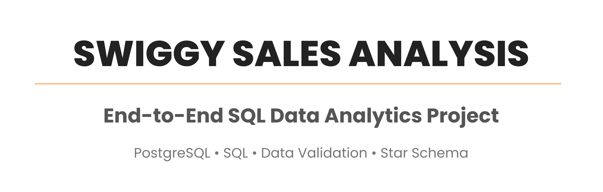
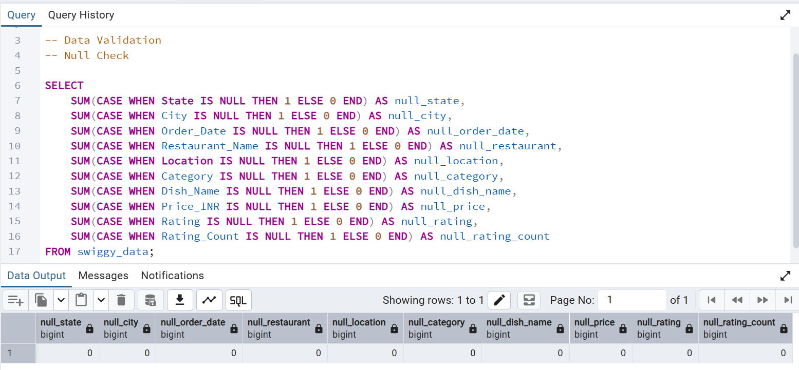
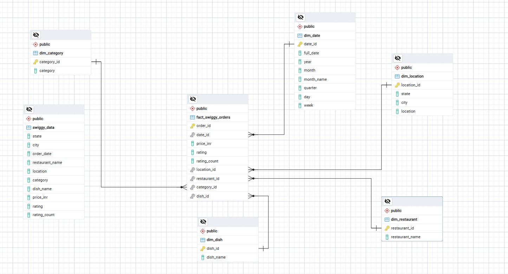
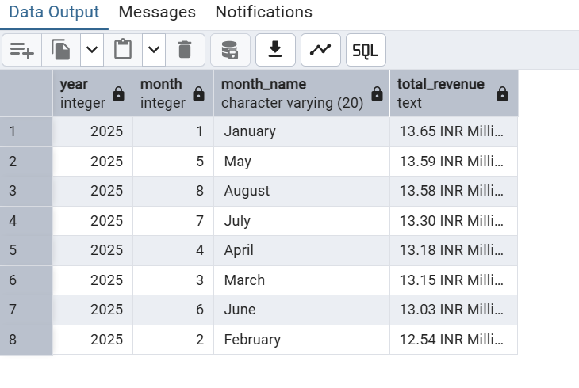

<p align="center">
  
</p>
# 🍽️ Swiggy Sales Analysis using SQL

An end-to-end SQL data analytics project that transforms raw Swiggy food delivery data into actionable business insights through data validation, cleaning, dimensional modelling, and analytical SQL queries using PostgreSQL.
## 🛠️ Tech Stack

- **Database:** PostgreSQL
- **Language:** SQL
- **Data Modelling:** Star Schema
- **Dataset:** Swiggy Food Delivery Dataset
- **Documentation:** Microsoft Word
- **Version Control:** Git & GitHub

## 📖 Project Overview
This project demonstrates an end-to-end SQL data analytics workflow using a Swiggy food delivery dataset. The project begins with raw transactional data and follows the complete analytics pipeline, including data validation, data cleaning, dimensional modelling using a Star Schema, and business analysis through SQL queries.

The primary objective is to transform raw operational data into a structured analytical database that supports efficient reporting and meaningful business insights.

## 🎯 Business Problem

Food delivery platforms generate massive volumes of transactional data every day. However, raw operational data often contains inconsistencies, duplicate records, and unstructured formats that limit meaningful analysis.

This project focuses on transforming raw Swiggy food delivery data into a structured analytical database by applying data validation, cleaning, and dimensional modelling techniques. The final objective is to answer key business questions and generate actionable insights that support data-driven decision-making.


This project addresses the following objectives:

- Validate the quality of the raw dataset
- Detect and remove duplicate records
- Standardize date formats
- Design a Star Schema for analytical reporting
- Generate business KPIs using SQL
- Extract actionable business insights from the data

  ## 📂 Project Structure

```text
swiggy-sql-sales-analysis
│
├── Dataset
│   ├── Swiggy_Data.csv
│   └── swiggy_data.xlsx
│
├── SQL Scripts
│   ├── 01_Table_Creation.sql
│   ├── 02_Data_Validation.sql
│   ├── 03_Order_Date_Conversion.sql
│   ├── 04_Star_Schema.sql
│   └── 05_Business_Findings.sql
│
├── Documentation
│   └── Business Requirements.docx
│
├── Images
│
└── README.md
```

### 📁 Folder Description

| Folder | Description |
|---------|-------------|
| **Dataset** | Contains the raw Swiggy dataset used for data validation, cleaning, and analysis. |
| **SQL Scripts** | Contains SQL scripts organised in execution order, covering table creation, data validation, data transformation, star schema design, and business analysis. |
| **Documentation** | Includes the Business Requirements Document and other project documentation. |
| **Images** | Stores the ER Diagram, SQL query outputs, and screenshots used in the README. |
| **README.md** | Provides an overview of the project, workflow, implementation, and key findings. |

Raw Swiggy Dataset
        │
        ▼
Table Creation
        │
        ▼
Data Validation
        │
        ▼
Data Cleaning & Transformation
        │
        ▼
Star Schema Design
        │
        ▼
Business Analysis
        │
        ▼
Key Business Findings

## 🔄 Project Workflow

This project follows a structured SQL analytics workflow to transform raw transactional data into meaningful business insights.

1. **Table Creation**
   - Imported the raw Swiggy dataset into PostgreSQL and created the base table.

2. **Data Validation**
   - Checked for null values, duplicate records, inconsistent data, and data quality issues.

3. **Data Cleaning & Transformation**
   - Standardized date formats and prepared the dataset for analytical processing.

4. **Star Schema Design**
   - Created dimension and fact tables to build a scalable analytical data model.

5. **Business Analysis**
   - Wrote SQL queries to calculate KPIs, identify trends, and answer key business questions.

6. **Key Findings**
   - Summarized the analytical results into actionable business insights.

## 🔍 Data Validation

The dataset was validated before analysis to ensure data quality and reliability. Validation checks included identifying null values, duplicate records, blank values, and verifying data types for analytical processing.

### Sample Validation Outputs

#### Null Value Check

<p align="center">
  
</p>

#### Duplicate Record Check

<p align="center">
  
</p>

#### Date Conversion

<p align="center">
  
</p>

## 🗄️ Database Design (Star Schema)

To support efficient analytical reporting, the raw transactional dataset was transformed into a **Star Schema**. This dimensional model organizes descriptive information into dimension tables while storing transactional metrics in a centralized fact table.

The Star Schema simplifies complex analytical queries, reduces data redundancy, and provides a scalable foundation for reporting and business analysis.

### Dimension Tables

| Table | Description |
|-------|-------------|
| **dim_date** | Stores date-related attributes for time-based analysis. |
| **dim_location** | Contains geographical information such as city and state. |
| **dim_restaurant** | Stores restaurant-specific details. |
| **dim_category** | Contains food category information. |
| **dim_dish** | Stores dish-level information. |

### Fact Table

| Table | Description |
|-------|-------------|
| **fact_swiggy_orders** | Stores transactional order details and links all dimension tables through foreign keys. |

<p align="center">
  
</p>

## 💻 SQL Implementation

The project is divided into modular SQL scripts, with each script focusing on a specific stage of the analytics workflow.

| SQL Script | Purpose |
|------------|---------|
| **01_Table_Creation.sql** | Creates the raw table and imports the dataset. |
| **02_Data_Validation.sql** | Performs null checks, blank value detection, duplicate identification, and data quality validation. |
| **03_Order_Date_Conversion.sql** | Converts the `Order_Date` column into the appropriate `DATE` data type for time-based analysis. |
| **04_Star_Schema.sql** | Builds the dimensional model by creating dimension and fact tables. |
| **05_Business_Findings.sql** | Contains analytical SQL queries used to calculate KPIs and generate business insights. |

## 📊 Business Analysis

After preparing the dataset and designing the analytical data model, SQL queries were developed to evaluate business performance across multiple dimensions.

The analysis focuses on identifying trends, measuring key performance indicators (KPIs), and answering business questions related to sales, customer preferences, restaurant performance, and geographical distribution.

## 📈 Key Performance Indicators (KPIs)

The following KPIs were calculated using SQL:

- Total Orders
- Total Revenue
- Average Dish Price
- Average Customer Rating
- Total Number of Restaurants
- Total Cities Covered
- Total States Covered

 ## 📑 Analytical Queries

The project includes SQL queries to answer business questions such as:

- How many total orders were placed?
- What is the total revenue generated?
- Which restaurants received the highest number of orders?
- Which cities generated the highest sales?
- Which states contributed the most revenue?
- Which cuisine categories were the most popular?
- Which dishes generated the highest revenue?
- How do monthly and quarterly sales trends compare?
- What is the distribution of customer ratings?
- How are customers distributed across different spending buckets?

## 💡 Key Business Findings

> **This section will be updated after executing the analytical SQL queries and documenting the actual findings.**

## 📷 Project Screenshots

Screenshots of the data validation process, Star Schema, SQL query outputs, and analytical findings will be added here.

### ER Diagram


---

### Monthly Revenue Analysis



## 🧠 Skills Demonstrated

### SQL & Database

- SQL Query Writing
- PostgreSQL
- Joins
- Aggregate Functions
- Window Functions
- Common Table Expressions (CTEs)

### Data Engineering

- Data Validation
- Data Cleaning
- Data Transformation
- Data Modelling
- Star Schema Design
- Dimensional Modelling

### Business Analytics

- KPI Development
- Trend Analysis
- Revenue Analysis
- Customer Behaviour Analysis
- Business Intelligence
- Analytical Problem Solving

### Tools

- PostgreSQL
- Git
- GitHub
- Microsoft Word

## 📌 Conclusion

This project demonstrates a complete SQL-based analytics workflow, from preparing raw transactional data to designing a dimensional data model and generating analytical insights. It showcases practical SQL skills, data modelling techniques, and a structured approach to solving real-world business problems.

